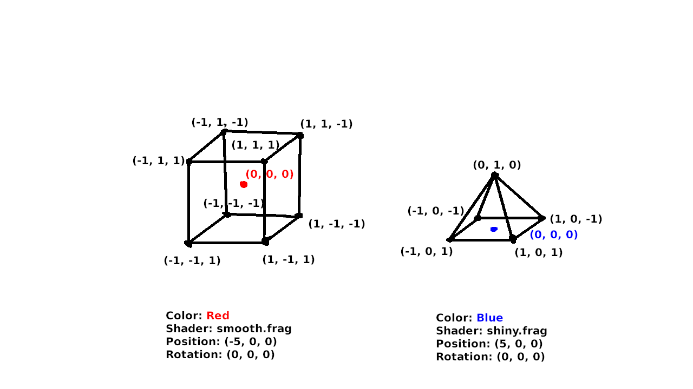

May 21, 2024
# How Computers Display 3D Graphics
The production of 3D graphics is one of the most important uses of computers today. This is because we humans experience our world in 3 dimensions. Generating 3D graphics on a computer allows us to create experiences that mimic the real world more accurately than ever before. This includes games, simulations, animated films, and more. Some of these experiences are so realistic that it can before quite difficult to differentiate computer-generated graphics to a real photo. So let's dive in!
## Prerequisites
It may be helpful to have some knowledge of the components of a computer and how they interact. Some parts of the process may also be easier to understand with some knowledge of linear algebra. (matrix/vector math, transformations)
## Rendering methods
A computer's goal in producing 3D graphics is to convert a mathematical representation of a 3D scene into a 2D image that can be displayed on a computer monitor. This process is called rendering. There are two main ways that this is done:
### 1. Raytracing
This method has become more common in recent years due to its ability to accurately simulate how light behaves in an environment. It allows us to generate hyper-realistic 3D images using a computer. The downside is that it takes a lot more computing power to render a raytraced scene than it does to render conventionally. Animated films have used this technique for a while, but it can take minutes or hours to render a single frame with raytracing. Recent advancements in graphics processing technology have allowed for raytracing effects to be computed in real-time, making it possible to be used in video games.
### 2. Conventional rendering (Rasterization)
This is the way that 3D graphics have been rendered for decades. It encompasses a sequence of steps that converts a 3D scene into a 2D image, and it's what we are going to be covering in this article. Rasterization is performed using a sequence of steps called the graphics pipeline. This sequence of steps is executed in order for every frame that is rendered. For real-time graphics like those in video games, that means that this entire process has to be accomplished in under 16.67 milliseconds for 60 frames per second.
## The graphics pipeline
The sequence of steps in a graphics pipeline may depend on the exact situation, but they typically encompass some variation of the following: Input assembly, Vertex shading, Rasterization, Fragment shading, and Presentation. We're going to cover each of these steps in detail.
### Input assembly
This is the first step in the graphics pipeline. The purpose of this step is to prepare and ensure that all of the data that is needed to render the final image is available. Most of the processing that ends up producing the final frame is done on the GPU, a processor designed specifically to perform graphics calculations. An important part of the input assembly step is transferring all of the data that is needed by the GPU into graphics memory, a dedicated part of the computer's memory found on the graphics card. Once everything is loaded, our scene might look something like this:

In the input stage, the scene is composed of a number of 3D objects, often called meshes, that are made up of vertices (points) connected by edges (lines) or faces (sides). The meshes also have additional data, such as a color (or colors), a shader, position, and rotation. It may be surprising, but all 3D scenes are simply composed of simple shapes connected with straight lines. Very often, any faces that have more than 3 edges are simplified by converting them into triangles (often called tris for short). For example, each of the 6 square sides of the cube would be converted into 2 triangles. This makes it easier for the GPU to process because it only has to deal with rendering the simplest shape. Triangles are also important because there is only one possible triangle (or plane) that can pass through 3 points in a 3D environment. This is not guaranteed with 4-sided- (quads) or more-sided- (n-gons) shapes.

Even curved surfaces are actually composed of flat triangles. In later stages of the pipeline, we apply shading effects that make these flat surfaces appear smooth.
### Vertex shading
In the vertex shading step, we perform processing on each of the vertices in our scene individually. This is the most mathematically involved step, because it involves linear algebra, coordinate systems, matrix and vector math and transformations. If you have a decent grasp of those, carry on. Our goal in this step is to end up with a final position (and possibly color, depending on how the shader is written) for each of our vertices. The step works by executing a small piece of code, called the vertex shader, on each of our vertices. The process of executing the same code thousands of times with different input is what the GPU is designed to do.

#### The 3D spaces
Our vertices pass though several coordinate systems, or "spaces", and are moved from one to the next by transformations. The vertices can be thought of as vectors, and the transformations as matrices. This means that applying a transformation can be expressed as a matrix-vector multiplication. The transformations are as follows:
##### 1. Model Space
This is where our vertices start out. In this space, the positions of the vertices are defined relative to a local origin. In the previous diagram, that is represented by the coloured dot in the centre of the cube and pyramid. When the vertices are loaded from memory or a 3D model file (e.x. .obj, .gltf), they start in model space.
##### 2. World Space
In world space, the positions of all the vertices are defined relative to a common origin. This is the "(0, 0) point" in your Minecraft world, for example. We transform the vertices from model space to world space using a model matrix. This matrix encompasses a scale, followed by a rotation about the origin of the model. It is then followed by a translation, moving the vertices such that the origin point in model space ends up at the model's overall position in world space. For example, the cube's origin ends up at (-5, 0, 0) and the vertices of the cube are positioned relative to that.

##### 3. Camera/View Space
Now we must introduce the concept of the camera. The camera represents the user's view into the 3D world. It has a position and rotation, just like the 3D meshes, but it doesn't have any vertices. In camera space, the entire world is translated such that the camera is at the origin, and is rotated so that the camera faces directly down the negative Z axis. Note that the vertices must be transformed in the opposite direction of the camera, such that, for example, if the camera moves to the left, the entire world is translated to the right, and if the camera rotates upward, the entire world rotates downward.

##### 4. Screen Space
This is the final coordinate space that our vertices will reside in. It is laid out such that the origin is the top left of the screen, and (1, 1) is the bottom-right. For the moment, we will forget about the Z component as we are trying to produce a 2D image, although it will become important in future stages. There are two types of transformations from camera space to screen space, which we call "projections". They are the orthographic projection, where objects/vertices do not change based on their distance to the camera, and the perspective projection, where objects/vertices converge (become smaller) as they move away from the camera. (An isometric projection is a special case of the orthographic projection, with a specific rotation of the camera.) The projection transformations must take into account the aspect ratio of the display, and the vertical field-of-view in the case of the perspective projection.

With that, the vertices are transformed such that ones that are visible on the screen have coordinates between (0, 0) and (1, 1). In addition to position, we may also assign a color to each vertex. In older rendering techniques, lighting calculations would occur in the vertex shader to generate a final color for each vertex. These would then be interpolated between the vertices. This isn't often done any more, and lighting will be discussed in the next sections.
### Rasterisation
This is the most important stage in the pipeline (at least in my opinion), and it's the namesake for the entire rendering technique as a whole. It was the first stage of the pipeline to be offloaded to the GPU when they became available. The purpose of the rasterisation stage is to convert the collection of vertices into a grid of fragments. A fragment is similar to a pixel, but it isn't guaranteed to be displayed in the final frame. Multiple fragments can overlap each other. A fragment has more that just a color, however. It also has a position and normal (the direction it faces).

There are two important processes that happen in the rasterisation stage: fragment generation and interpolation.
#### Fragment generation

#### Interpolation

### Fragment shading
We now have a grid of fragments that are all visible on the screen. Each fragment has a normal vector representing the direction that it faces, and a starting color. The goal of the fragment shader is to determine the final color of the fragment by applying lighting and material effects. The fragment shader also takes in the intensity and direction of nearby light sources as input.

By taking the dot product of the fragment's normal vector and the direction to the light source, we get an intensity value. A value of 1 means that the vectors are perfectly aligned and maximum illumination should be applied. A value of 0 means that the vectors are perpendicular and no illumination should be applied. A negative value means the vectors are facing opposite directions and no illumination should be applied, so we "clamp" the illumination to a positive value, taking the max() of the intensity and a small nonzero number, representing the ambient lighting. This way, fragments that aren't illuminated don't appear pitch black, but instead still recieve some ambient light. The final fragment color is calculated by multiplying the red, green, and blue components by the intensity value. The lighting calculation is shown below:

finalColor = startColor * max(dot(normal, lightDirection), 0.1)

We can then forget about the position and normal of the fragments, as all we need for the final frame is the color of each pixel.

### Presentation
With that, we have a completed 2D grid of pixels that makes up our final image. The presentation stage is simply a matter of sending off the frame to wherever it needs to go to be displayed. In most cases, it gets sent to the operating system so that it can be displayed in a window, and combined with all the other windows to be shown on the monitor. It might also be written to a file in the case of offscreen rendering. This is used when you want an image file as your result, or if you're rendering a film, or if the computer that's rendering has no display (i.e. a server).
## That's all!
Thanks for reading this article. I don't have much to say at the end of this one. I just wanted to get some ideas written down, and I hope that you've gained an appreciation for all that computers have to do to generate 3D graphics.