# So you think you can Linux?
Unless you've been living under a rock since 1991, you've probably heard of someone talk about Linux at some point. But what is Linux, and how can you try it out? It is recommended to have this webpage open on a mobile device so that you can use your computer for installation.

If you just want to try Linux out and don't care about the history, skip ahead to "Picking a distro".
## The elephant in the room
Before someone schools me for calling Linux "Linux" (see [this](https://www.youtube.com/watch?v=QlD9UBTcSW4)), I need to say that what I am referring to as Linux is not in fact called Linux. Instead, it should be called GNU/Linux, or even just GNU (a recursive acronym for "GNU's not UNIX"). Why? GNU is a software company dedicated to creating an Operating System (OS for short, the collection of software that makes your computer run, examples are Mac OS and Windows) based on a set of standards called POSIX (explained in the next section). They started developing GNU around the same time Linux was being developed. So what exactly is Linux if it isn't an OS unto itself? Linux is a kernel, the component of an OS whose purpose is to distribute system resources (memory, processing time, etc.) among other programs, as well as define an easy way for programs to interface with those resources. Linus Torvalds, the creator of the Linux kernel had a goal of creating an open-source POSIX-compilant kernel. Meanwhile, GNU was in the process of creating the kernel for their OS, called Herd, but they realized that it was too much of a hassle. So instead, they partnered with Linus Torvalds and decided to allow users to ship the Linux kernel with the GNU operating system. Users began calling this concoction of GNU and Linux "Linux", probably because it's easier to say Linux than "Gee Enn You Slash Linux". The rest is history. So, for the rest of this article, I'll be calling what is officially called GNU/Linux "Linux".
## History of Linux: Multics, UNIX, and POSIX
the 1970s: New developments in computing technology. Faster electronics, mass storage, and better everything. The It seemed that all of Humanity's computing needs would be fulfilled! But, there was one small (large) problem: The slowest part of the computer wasn't the computer at all! It was the human operator. There needed to be a way for computers to operate themselves. It took too long to gather together your program on a bunch of punchcards, feed them in one by one, and press run. Just to run one program. Then the next person came along and had to do the same thing, gather the program in the right order, feed it in, press run. It was taking longer for people to load their programs in than it was to run them. So, the buisnesses that could afford the powerful computers like the PDP series developed Batches. Groups of programs that could be executed at once. However, this still wasn't great. It would be nice if multiple programs could run at once, on the same hardware. So, developers at Bell Labs (Now AT&T) created Multics, a timesharing, multitasking, computer operating system.

However, Multics turned out to be fairly unsuccessful. Dennis Ritchie, a developer of the Multics OS remarked "In Multics, it felt like half the code I was writing was error handling code." Him and another Bell Labs employee, Ken Thompson, decided to rewrite Multics, leaving out the error handling code. Instead, whenever there was a system error, it would call a routine called panic() that printed the word "panic" to the screen and freezed the system. You would then shout down the hall, "Hey, reboot it!"

After UNIX version 5 was released, UNIX was made open-source. Because of this, Univerity of California Berkeley modified UNIX and created their own version: BSD (Berkeley Software Distribution). the BSD OS still exists today in the form of the NetBSD, OpenBSD, and FreeBSD operating systems. Another popular OS with root in UNIX is Oracle Solaris.

Later on, many companies decided to work together to create intercompatibility. They developed POSIX (the Portable Operating System Interface) standard, which standardized the way OS's would work from now on. POSIX kept many of the principals present in the UNIX OS (everything is a file, do one thing and do it well).

When GNU and Linux both came along in the 90's after the PC revolution in the 80's, they decided to reject PC compatibility and instead go for POSIX intercompatibility.

The PDP 11 computer
## Using Linux
So now that we know what Linux is, how could people try it out? Well, when GNU and Torvalds parterned together, they didn't explicitly ship the GNU OS using the Linux kernel. Instead, user were free to combine the GNU utilities with the Linux kernel on their own. This is bad for literally EVERYONE WHO DOESN'T HAVE OSDEV EXPERIENCE, so people and groups or companies started bundling GNU software and Linux with their own changes (called a distribution, or distro), and shipping it to users on CDs for them to easily install. Now with the rise of the internet, it's simple to download a CD or USB image and burn it to some media to install Linux to your computer.
## Picking a distro
Now, to actually start using Linux! First, you need to choose a distro, a collection of Linux software including Linux itself. It is possible to download Linux by itself, but you can't immidiately use it without combining it with a ton of other software. So, we download a distro, which does all this for us. Personally I recommend Debian, one of the first Linux distros ever created with a focus on stability over newness, although this really shouldn't be a problem unless you computer is less than a year old and has brand new hardware. To download Debian, go [here](https://www.debian.org/) and click the big Download button on the left. Immidiately, a file with the extension .iso starts downloading. That's right, 100% FREE!

So what is this .iso file? A .iso file is an image of a CD or USB device, meaning that all of the data on the device was dumped into a single file. To Install a distro you need to dump this file back onto the USB device or CD.
## Getting to the Debian installer
I'll go ahead and assume you downloaded Debian and the .iso from the last step is on your computer. Next you need to download BalenaEtcher from [here](https://www.balena.io/etcher/). Click the big green button to download it, and click to install it once its finished downloading. Etcher is a program that allows you to dump the contents of the .iso onto a USB flash drive, so that you can install Linux to your computer. Now, to place the intaller on the USB key, insert the key into the computer. NOTE: ALL DATA ON THIS KEY WILL BE LOST WHEN THE INSTALLER IS ADDED. Start Etcher. Choose the .iso file. Choose the USB stick. Click flash. It really couldn't be simpler. When the flashing is complete, reboot your computer. Now for the hard(ish) part: as the computer is booting up, press the boot menu button. This button may vary depending on your manufacturer. For Dell, the button is F12. For Lenovo, you press Enter, then F12. For some manufacturers, its F7. If you have no idea the best shot is F12. Once you are in the boot menu, select the USB as the device you wish to boot from. Congradulations, you've gotten to the Debian installer!
## Installing Debian
Once in the installer, select an installation option. You can install Debian graphically (the installer has a mouse and GUI) or using a TUI (a UI made with text that you control with arrow keys). I would recommend graphical unless you have an old computer. Select using arrow keys and Enter.

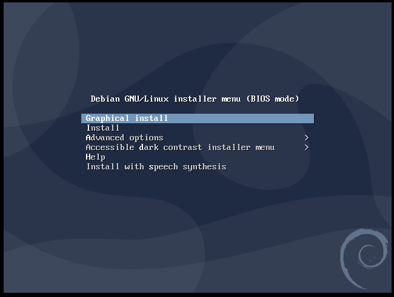

Next, you choose the language for the installer and installed system. If you can understand this article, I assume you'll select English. Select continue at the end of every step.

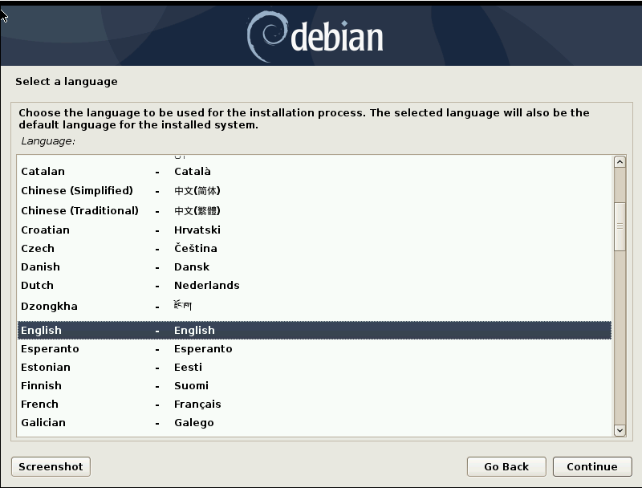

Now, choose your location. I'm located in Canada.

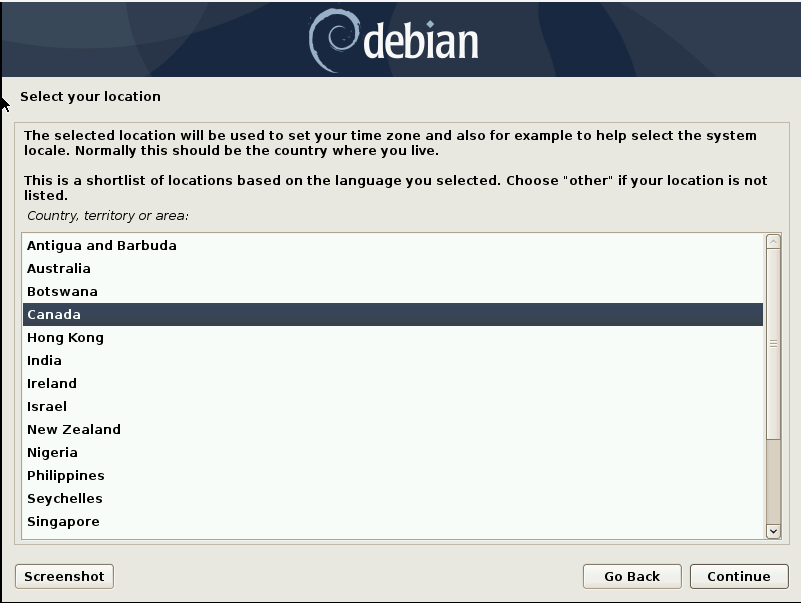

Once this is done, you can choose the keymap to use. In Canada, we (normally) use the American English keymap, surprisingly not Canadian Multilingual.

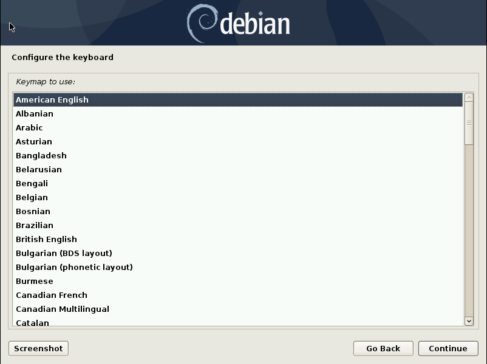

After you continue, the system will attempt to automatically connect to the internet. (ensure you have a WiFi or ethernet connection). Now enter a hostname, the name of this computer.

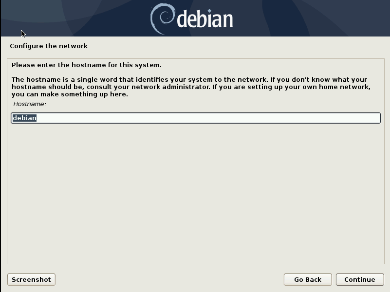

For the domain name, type in whatever (it really doesn't matter) and add a .com to the end.

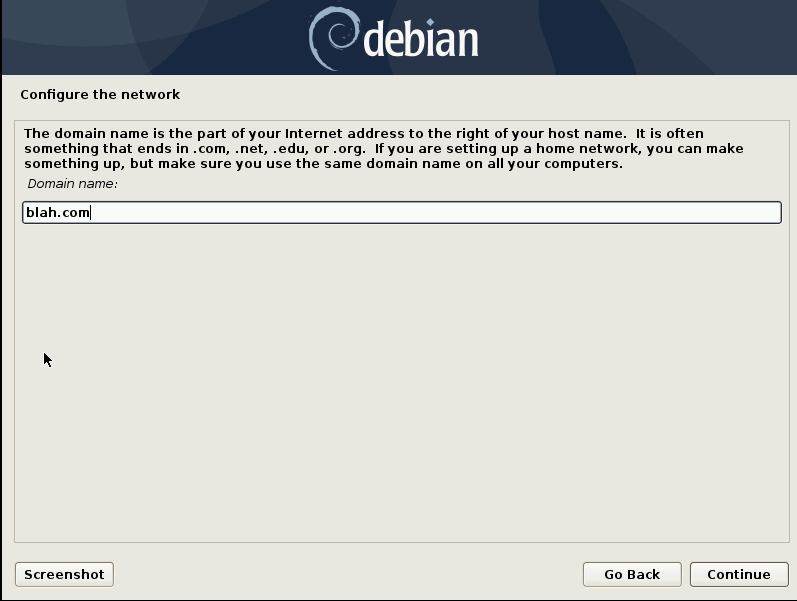

Now we need to create a root password. root is the name of the account that has full access to the system, including every user's files. The root password should be fairly long and hard to guess.

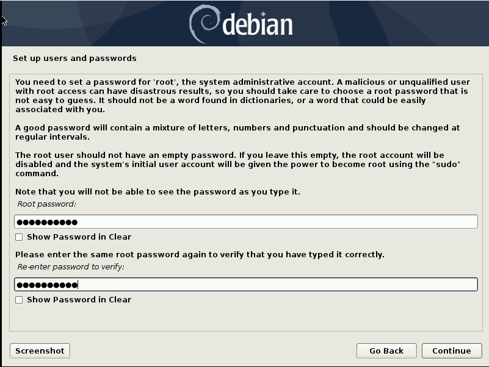

Next, we need to create a normal account that does not have full system access. You may enter the full name for this user account or leave it blank.

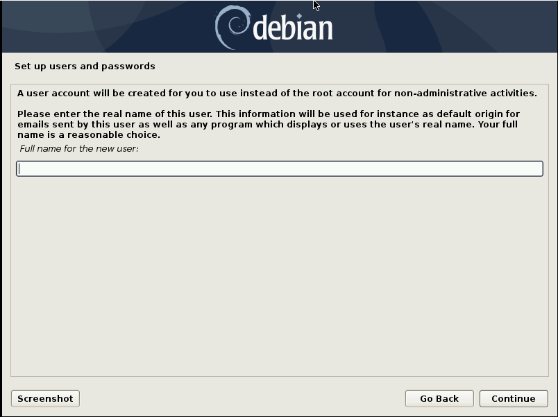

We now enter the username used to log into this user account.

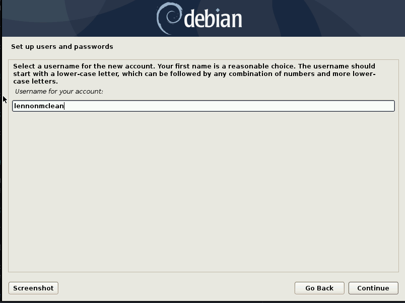

Again, we add a password, this time for the user account.

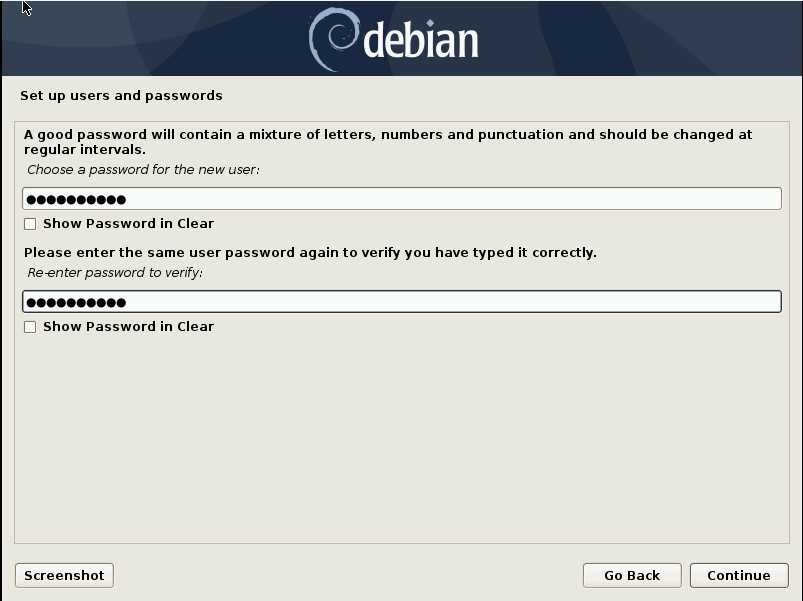

Next, select the timezone you are located in, based on the country you identified.

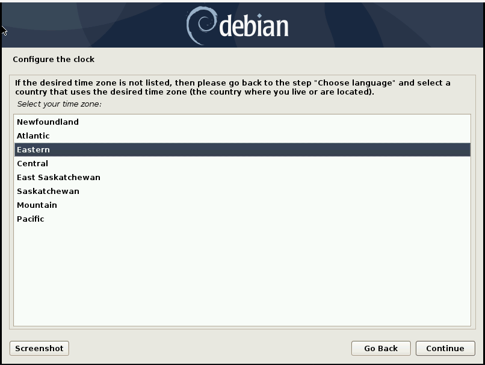

Ah, now comes the part all mortal OS enthusiasts fear at some point: Partitioning and formatting. While Windows may have you under the impression that formatting means "erasing all data on your hard drive", it's a little less dramatic. Nonetheless: be careful. Doing this incorrectly could result in data loss, although it doesn't explicitly mean it.
### Lennon's crash course on partitioning and formatting
#### Partitions
Partitions are slices of a disk that have the same properties and function as an entire disk. You can divide a disk up into partitions that behave the same way as the disk itself. The process of doing this is called "partitioning".
#### Partition Table
The partition table is a bit of data at the start of a partitioned disk that defines where each partition starts and ends. There are two major partition table formats: MBR (master boot record) and GPT (GUID partition table). GPT is newer. When people talk about initializing, regenerating, or recreating a partition table, they basically mean deleting all partitions on a disk and starting fresh.
#### Formatting
Formatting is setting up a partition for a specific purpose, usually to store files. Some common filesystems (data structures that divide a partition or disk into individual files) that partitions can be formatted to are FAT (MS-DOS), APFS (Mac OS), NTFS (Windows), or EXT4 (Linux). Usually formatting erases the contents of a partition so it can be dangerous if done incorrectly.
#### Mount Point/Drive Letter
A mount point or drive letter is wherever your filesystem appears to the system. on POSIX systems like Mac OS, BSD and Linux, when you mount a filesystem its files appear at a mount point, a sort of virtual folder that contains the files. On DOS and Windows, the filesystem is attached to a drive letter, under which the files can be accessed. The mount point for the system filesystem on POSIX systems is "/", and the drive letter for the system filesystem on Windows is C:.
#### Unpartitioned disk
A disk formatted directly without being divided into partitions. Because disks and partitions have the same properties, a disk can be formatted with a filesystem directly without being partitioned. This is common in floppy disks, where there are usually no such thing as "partitions". Instead, floppies usually only contain one filesystem for use on a single system. This is also the case for CD's, where by default they only contain one filesystem. The ISO9600 filesystem. you can't add other filesystems to the same CD without partitioning.

So with what we now know about partitioning and formatting, lets set up our disk to work with Linux.
### Starting fresh
Option one is to initalize the partition table of your hard disk to delete any OS you have on your computer currently. Then, create a new partition formatted to EXT4 and with mountpoint /. This makes Linux the only OS on your computer and deletes Windows and all of its files.
### Dual-booting
Option two is to run two OS's on one system. When the computer starts up, you can choose which one to run. Resize your Windows filesystem (make it smaller) to make room for the Linux partition. Create the Linux filesystem by selecting the free space created by resizing the Windows parition, and choosing "/" as the mountpoint and EXT4 as the partition format.

When everything is complete, select Finish partitioning and write changes to disk. Select No for swap space and Yes to confirm the partitioning.

You should now be installing the base system.

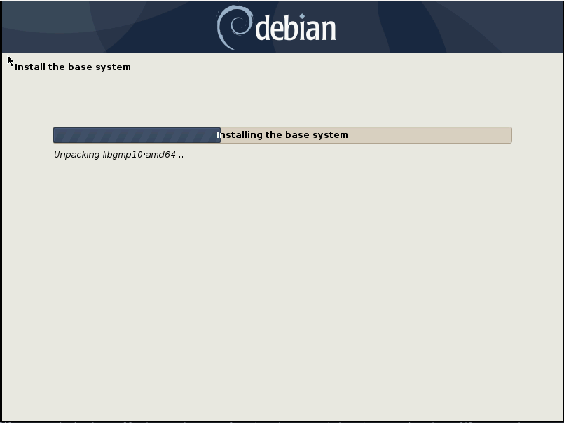

When this is complete you will need to configure the APT package manager: the built-in app store that comes with Debian. Answer No to scanning another CD. Choose your country and choose deb.debian.org as the mirror. Leave the HTTP Proxy field blank.

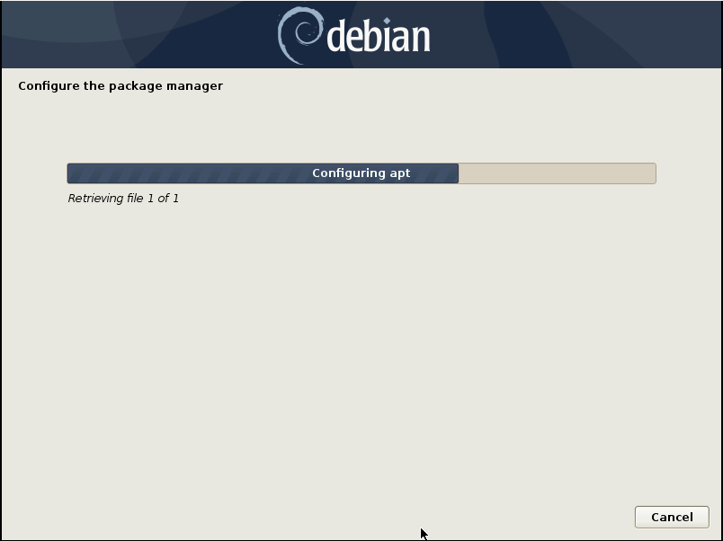

When this is complete you will need to select and install extra software for the system. Answer No to the popularity contest. You should be dropped into a utility called Tasksel (Task Selector). This utility allows you to select and install extra software to be in your Debian installation. Install the GNOME desktop environment, the SSH server, and basic system utilities.

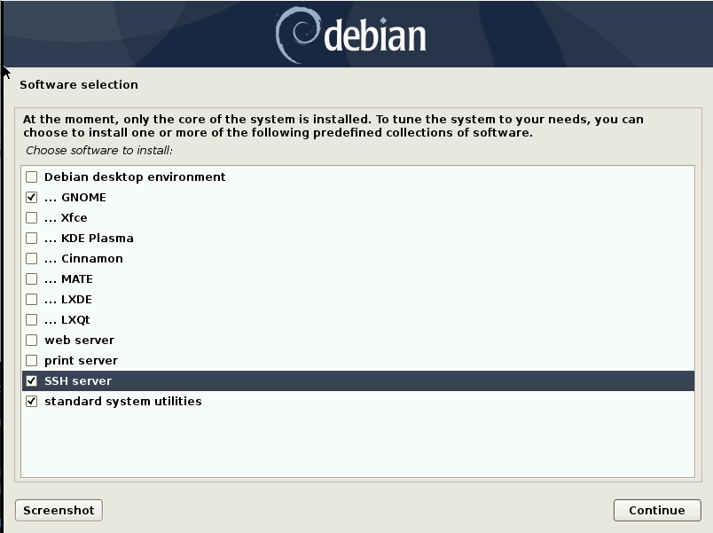

Almost done! After Tasksel is done running, we just need to install GRUB, the GRand Unified Bootloader. The bootloader is the first program to run when the computer starts up. It loads the kernel, the core of the OS, and passes control of the computer to it. Ensure that if you installed Debian alongside Windows or another OS that GRUB indentifies the OS. Select the computer's hard disk to install GRUB to. NOTE: if you are on a modern computer (< 2010) then the GRUB installation is hidden from you, as it needs no intervention.

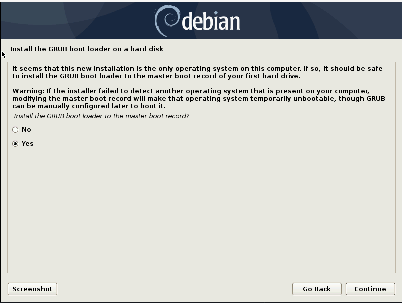

Congradulations! You just installed Linux! But: lemme let you in on a little secret: The entire installation wizard used to install Linux WAS Linux, running off the USB! Anyways, to try out your new Debian installation, reboot. Make sure to take out the USB stick. When the computer starts up you should see a menu with one entry for each OS installed on the computer. Maybe its just Linux, or maybe you also have Windows in the list. This is where you choose the OS to boot when starting up.

OK, it's getting late. That's it for me. Have fun with Linux! :D

Click [here](/) to return to the home page.

<title>So you think you can Linux?</title>
