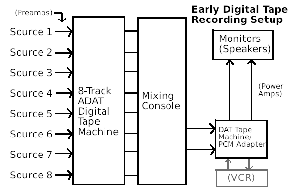
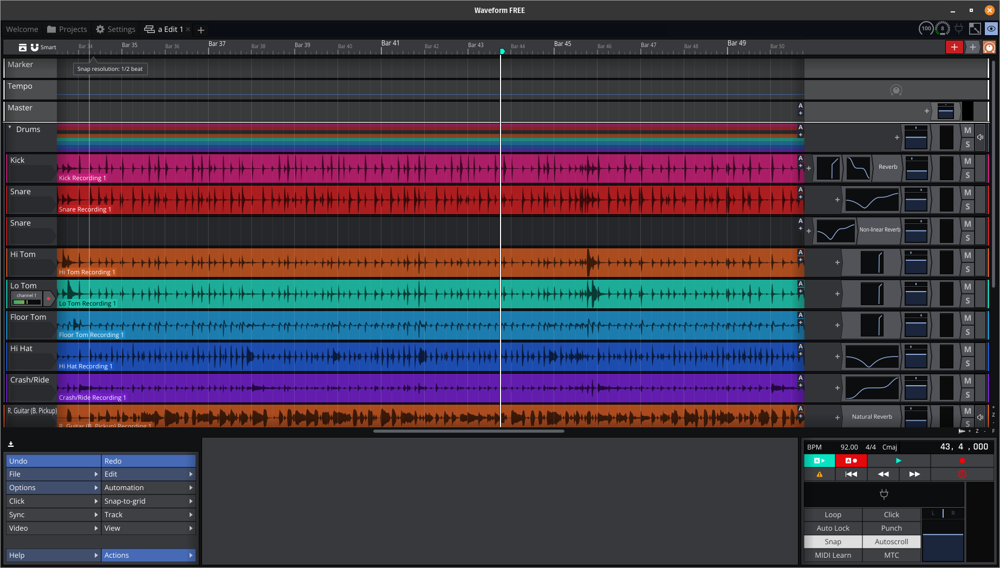

# The History of Sound Recording
September 6th, 2025

Humans have been recording sound for over 3 millennia. The earliest sound recording ever discovered was a collection of cuneiform tablets from Mesopotamia that instructed a performer on how to play a hymn on a lyre. Specifically, this is the earliest known instance of musical notation, a kind of "sound recording" that is still used today. But the history of musical notation is not what I'm going to describe here.

## What is Sound?

Sound, from the perspective of our ears, is simply fluctuations in air pressure that are translated into meaningful perceptions by our brain. Recording sound, in the more common sense of the term, is therefore just a matter of recording the fluctuations in air pressure and playing them back for our ears and brain to decode.

## The Phonograph

The earliest device created for this purpose was the phonograph, invented by Thomas Edison in 1877. The earliest model consisted of a horn, responsible for picking up and playing back sound, a wax cylinder, for recording the sound, and a stylus, for cutting a groove into the wax that acted as an analog of the sound wave recieved by the horn. Sound waves entered the horn and were funneled towards the stylus, causing it to vibrate in step with the sound waves. This cut a groove into the wax cylinder, which was rotated at a constant speed. To play back the sound, the wax was allowed to harden, the stylus returned to the start of the groove, and the cylinder rotated at the same speed. The groove in the wax caused the stylus to vibrate, which caused vibrations in the air which were amplified by the horn, allowing the sound to be heard.

In 1888, the Gramophone was invented. (Gramophone is a brand name, it's really just a modified type of phonograph.) The Gramophone used discs made of out shellac or PVC (polyvinyl chloride, leading to the use of the term "vinyl" for phonograph records - this is the same PVC used to make pipes) instead of wax cylinders. These were smaller and cheaper, though they required specialized equipment to make a record, capable of cutting PVC. However, once one record was made, it could be quickly copied by making a mold out of the original record and stamping or "pressing" new records using the mold.

If you wanted to record multiple sound sources at the same time using a phonograph, you would have to place them all in a room together, with their distance to the phonograph recording machine determining their volume. Everyone would have to play at the same time, and no modifications would be possible after the initial recording (so it had to be perfect!)

Phonograph records were the only way to record sound for more than fifty years. But by the 1930s, advancements in electronics led to a new method for recording sound.

## Microphones, Speakers, and Magnetic Tape

Sound, as mentioned, is just fluctuations in air pressure. So sound recording is a matter of recording the air pressure as it changes over time. One way to do this would be to translate the air pressure into an electrical signal, where a higher voltage, current, or conductance represents a greater air pressure, and the opposite represents a lower air pressure. Therefore, a device is needed that can convert sound waves to electrical waves, and vice versa. These devices are called transducers. Microphones are devices that translate from air pressure to electrical signals, and speakers (technically loudspeakers) do the opposite.

The earliest type of microphone was the carbon-grandule microphone. It consists of some carbon (graphite) enclosed in a capsule with holes that allow the air to come into contact with the granules. When the air pressure increases, the carbon granules are compressed more tightly, reducing the electrical resistance of the device. The opposite occurs when the air pressure drops. Carbon-grandule microphones do not produce an electrical voltage themselves, so a power source is needed to get a signal from them.

Speakers have not changed nearly as much as microphones since their invention. They all work roughly the way, consisting of a mobile coil of wire attached to a diaphragm, wrapped around a stationary magnet. When an electric current passes through the coil, it produces a magnetic field which repels or attracts itself to the magnet, causing it and the diaphragm to move according to the electrical signal. The diaphragm pushes and pulls the air, creating sound.

  
(A loudspeaker.)

Later microphones began to rely on the same principle as the loudspeaker, just in reverse. When sound waves cause the diaphragm to move, it moves the coil through the magnetic field, producing a current according to the diaphragm's movement. This current is so small, however, that this type of microphone was not useful until the invention of electronic amplification, thanks to the vacuum tube. This type of microphone is called a "dynamic" microphone, and is still widely used today.

  
(A dynamic microphone being used to record a snare drum.)

Magnetic tape can be used to record electrical signals. It consist of a ribbon of plastic (usually PET) film coated with magnetic particles (usually hematite, iron (III) oxide). The tape is moved past an electromagnet, and the particles are magnetized by the electromagnet controlled by an electric current. By amplifying the signal from a microphone and using it to control an electromagnet, the magnetic tape can be used to record an audio signal. The magnetized tape can then be run past the electromagnet at the same speed, recreating the electric current. This can then be amplified once again, and used to drive a loadspeaker, reproducing the sound.

## Advancements in Tape Recording - Multitrack and Mixers

Using magnetic tape to record audio came with several benefits: Recording could be started and stopped more easily, volume could be controlled more precisely, noise could be reduced by placing the microphone closer to the sound source, and the recording could be overwritten or modified in part after the initial take. Additionally, audio sources other than microphones could be recorded, such as electric guitars or bass guitars, electric organs, or electronic synthesizers. But many of the benefits of tape recording came with the advent of multi-track tape and the mixing console.

By allotting specific sections of magnetic tape to specific inputs, multiple sound sources or "tracks" could be recorded at the same time using the same tape and recording machine. But in order to play back these tracks through the same loudspeaker(s) similtaneously, a device called a mixing console, or mixer, was used. The outputs of the tape recorder were connected to the inputs of the mixer, which applied volume, pan, EQ control, and other effects to each track.

  
(A TASCAM 8-track tape machine and modern 8-channel mixing console.)

The audio signal of all the tracks were then combined and sent to the outputs. A second tape recorder, called the master tape machine, was connected to the outputs and recorded the final audio signal of all the audio sources combined.

Analog sound recording using magnetic tape persisted as the dominant way to record audio from the mid-1930s until the mid-1980s, giving it a 50-year lifespan comparable to that of the phonograph recorder. By the 80s, a new, more versatile technology had come onto the scene.

## Digital Sound Recording

Sound is just fluctuations in air pressure. (have I mentioned that?) If we could measure and write down the air pressure as it changes over time, and then recreate the air pressure as it was written down, we could have a way of reliably reproducing the exact same sound signal (or any kind of signal, for that matter) that was recorded.

That is the fundamental idea behind digital sound recording. By representing the audio signal as a sequence of numbers, we can make the recording immune to any kind of noise or interference. The problem for a long time, however, was finding a way to store all of the numbers that were written down. How many numbers are we talking about?

In the field of digital signal processing, there is something called the Nyquist-Shannon sampling theorem. It says that in order to digitally record a signal composed of various frequencies, we have to "sample" (write down the value) of the signal at a rate double that of the highest frequency we want to record. The highest frequency audible by humans is about 20kHz, and decreasing with age. So to record all of the frequencies in audible sound, we need to take samples at a minimum of 40kHz. That's 40 000 samples per second.

How precise do we need to be with these samples? The precision we choose determines our signal-to-noise ratio, or how much "tape hiss" we will end up with in our final recording. Analog studio master tape typically has a dynamic range of 60-70 dB. So assuming the loudest possible signal we can record is 0 dB, that means that sounds quieter than -60 dB will be inaudible in the recording, no matter how much we turn up the volume. They will be drowned out by the sound of the tape hiss.

In order to match or surpass this dynamic range with digital recording, we will need a sample size of at least 10 bits. This is roughly equivalent to a 3-4 digit decimal number. So in order to record the range of human hearing at a signal-to-noise ratio comparable to analog tape, we will need to write down 40 000 3-to-4-digit decimal numbers every second.

Wow. That's a lot of numbers.

Where do we write them all down? For many years, the most effective solution was to use video tape to store the digital values. A device called a PCM adapter took the place of the master tape machine, and used an analog-to-digital converter (ADC) to convert the audio signal to a sequence of binary numbers. These numbers were then encoded into a video signal and written to tape using a VCR. It could be played back by pressing play on the VCR and and the digital-to-adalog converter (DAC) in the PCM adapter would reproduce the audio signal.

  
(A Sony PCM digital audio adapter on top of a Betamax VCR.)

Specialized equipment would then take the final master video tapes and directly copy the digital data to CDs, for playback by consumers.

Eventually, in the early 90s, PCM adapters and VCRs would be replaced by DAT (Digital audio tape), and most multitrack tape machines would come to be replaced by ADAT, a system to store digital audio data on videotape without needing to convert it to a video signal. But the next (and final, for our purposes) innovation in audio recording would end up replacing magnetic tape for audio storage for good.

## Computer-based digital sound recording & DAWs

By the Late 90s and early 2000s, computing power had increased sufficiently for personal computers to record, mix, and master audio completely independently. A physical hardware device is needed to convert sound signals to digital data, and digital data back to sound, but all recording, storage, mixing, and mastering is handled by the computer in software called a digital audio workstation (DAW).

  
(Waveform 13, a modern digital audio workstation. Notice how the layout reflects the setup of old tape-based systems, with sources on the left, followed by the recording area, followed by the mixing section, followed by the mastering section at the bottom.)

  
(An 8-input, 10-output USB digital audio interface.)

Thanks for reading. It's now 1 AM as I'm writing this. I hope you enjoyed and check back later for new articles.